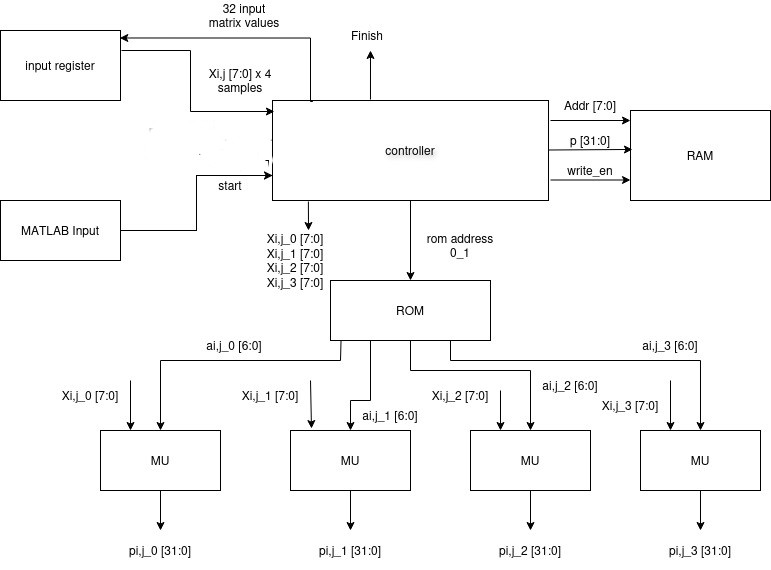
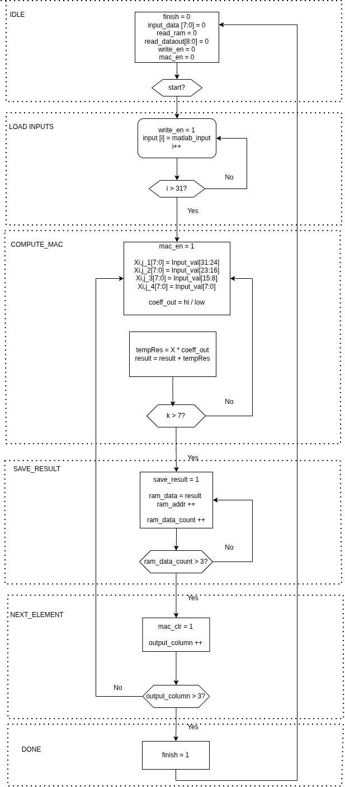
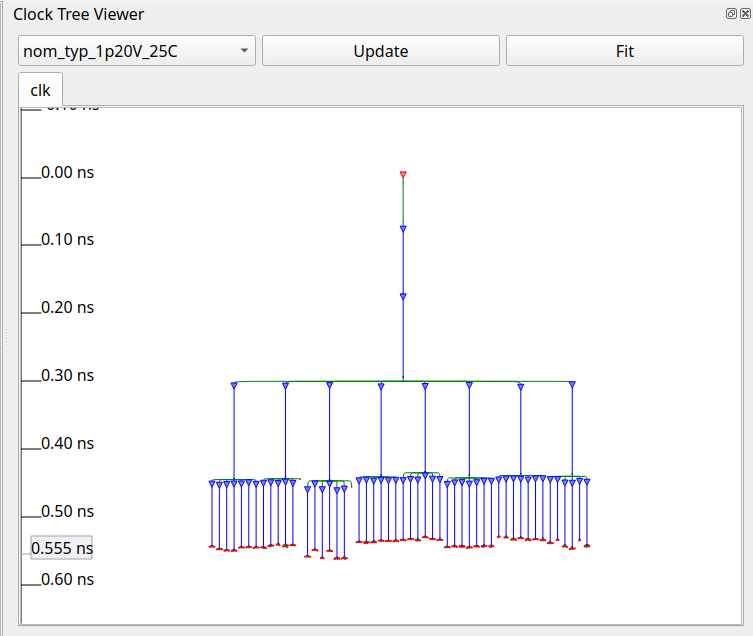
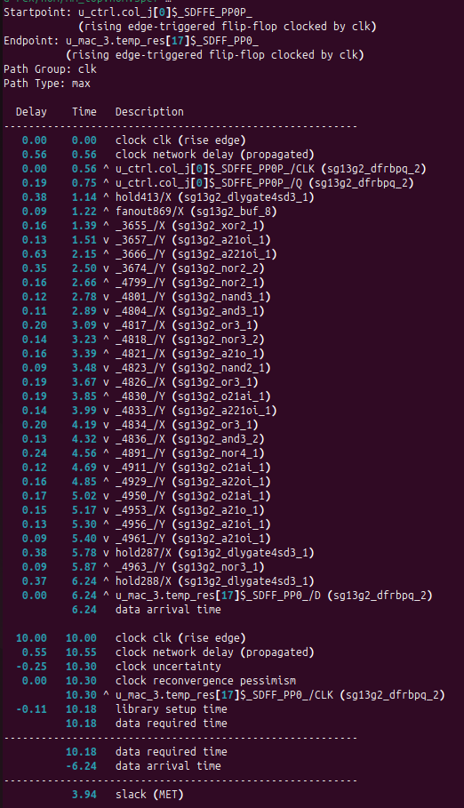

# Matrix Multiplication Accelerator  
**RTL Design, Formal Verification, and Physical Implementation Using Open-Source ASIC Tools**

This repository presents the complete design, verification, and physical
implementation of a small matrix multiplication accelerator developed using a
fully open-source ASIC toolchain.  
The project covers the entire hardware design flow, from **RTL architecture and
formal verification** to **logic synthesis, physical design, clock tree synthesis,
and post-layout timing analysis**.

---

## Project Overview

The accelerator computes the matrix product:

**P = X × A**

where:

- **X** is a 4×8 input matrix with 8-bit unsigned elements  
- **A** is a fixed 8×4 coefficient matrix with 7-bit unsigned elements  
- **P** is a 4×4 output matrix  

The design follows a **controller-driven, resource-shared architecture** that
employs four parallel MAC units to balance throughput, silicon area, and control
complexity.

---

## Architecture Overview

The top-level design is composed of the following components:

### Controller FSM
Coordinates input loading, MAC computation, result storage, and completion
signaling.

### Input Buffer
Stores the input matrix and provides four parallel 8-bit operands per cycle to
the MAC units.

### Coefficient ROM
Holds the fixed coefficient matrix and broadcasts coefficients to all MAC units.

### Multiply–Accumulate (MAC) Units (×4)
Perform iterative multiply–accumulate operations under controller control,
including **zero-skip operand isolation**.

### Output SRAM Macro
Stores computed output values using a single-port SRAM macro from the  
**IHP SG13G2 PDK**.

---

## Controller FSM (ASMD)

The controller is implemented as a finite state machine that sequences the entire
computation. Its behavior is captured using an **ASMD (Algorithmic State Machine
with Data path)** representation.

---

## Verification Strategy

Verification was performed using a **multi-layered approach**, combining
simulation-based validation with **exhaustive formal verification** of key RTL
modules.

---

## 1. Functional Verification (Simulation)

Functional correctness was verified using a SystemVerilog testbench:

- Input matrices were generated using **MATLAB**
- Simulation was performed using standard RTL simulators
- FSM sequencing, MAC accumulation, and SRAM read/write behavior were validated

Simulation waveforms confirm:

- Correct input buffer loading  
- Iterative MAC computation over multiple cycles  
- Result storage in SRAM  
- Correct readback of output data after full matrix computation  

---

## 2. Formal Verification (SymbiYosys)

In addition to simulation, **formal verification** was applied to critical RTL
modules to exhaustively prove correctness properties **without relying on
testbench stimulus**.

Formal verification was performed using:

- **Yosys**
- **SymbiYosys (SBY)**
- **SMTBMC**
- **Yices SMT Solver**

All formal properties are embedded directly in the RTL using SystemVerilog
**assert** and **cover** statements guarded by `ifdef FORMAL`.

---

## Verified Modules

### Controller (`controller.sv`)

Formally proven properties include:

- FSM state safety (only legal states are reachable)
- Validity of all FSM state transitions
- Correct behavior and reset of loop counters
- Control signal correctness and mutual exclusion
- **Liveness**: once `start` is asserted, the controller always makes progress and
  eventually reaches `finish`

---

### MAC Unit (`mac_unit.sv`)

Formally proven properties include:

- Correct accumulation behavior across clock cycles
- Proper reset and clear semantics
- Arithmetic correctness using `$past()`-based temporal assertions
- Correct zero-skip operand isolation behavior
- Cover property demonstrating sustained MAC activity over multiple cycles

---

### Input Buffer (`input_buffer.sv`)

Formally proven properties include:

- Correct write semantics and memory update behavior
- Stable memory contents across cycles
- Correct packing of four consecutive 8-bit values into a 32-bit output word
- Read-enable gating behavior
- Address range assumptions ensuring safe memory access

Cover properties are included where appropriate to demonstrate that meaningful
execution traces exist and that the verified properties are not vacuously true.

The top-level integration module (`mm_top.sv`) is **not formally verified** due to
the presence of a technology-specific SRAM macro, which is treated as a black
box. Formal verification is instead applied at the module level, where exhaustive
reasoning is tractable and meaningful.

---

## Logic Synthesis

- **Tool**: Yosys  
- **Technology**: IHP SG13G2 130 nm standard cell library  

### Outputs
- Gate-level netlist  
- Synthesis statistics  
- Area and cell utilization reports  

Post-synthesis analysis includes standard cell usage, logic complexity, and
module-level area distribution.

---

## Physical Design

Physical implementation was performed using an open-source RTL-to-GDS flow:

- **Flow**: LibreLane  
- **Tools**: OpenROAD, OpenSTA, KLayout  

### Major Steps
- Floorplanning  
- Placement  
- Clock Tree Synthesis (CTS)  
- Routing  
- Parasitic extraction  
- Post-layout timing analysis  

---

## Clock Tree Synthesis

Clock tree synthesis resulted in a balanced clock distribution network with
automatically inserted buffers.

- **Measured clock skew**: 0.251 ns – 0.266 ns  
- Skew remains well within acceptable limits for the target clock period  

---

## Timing Analysis

- **Target clock period**: 10 ns (100 MHz)  
- **Worst-case critical path delay**: 6.24 ns  
- **Setup slack**: 3.94 ns  
- **Estimated maximum operating frequency**: ≈160 MHz  

The critical path originates in the **controller FSM** and terminates in a **MAC
accumulator register**, indicating a control-dominated timing bottleneck rather
than an arithmetic one.

Hold timing was also verified post-layout, with no violations observed.

---

## Toolchain

### RTL & Formal Verification
- Yosys  
- SymbiYosys (SBY)  
- SMTBMC  
- Yices SMT Solver  

### Simulation & Debug
- GTKWave  

### Synthesis & Physical Design
- LibreLane  
- OpenROAD  
- OpenSTA  
- KLayout  

### Technology
- IHP SG13G2 130 nm PDK
